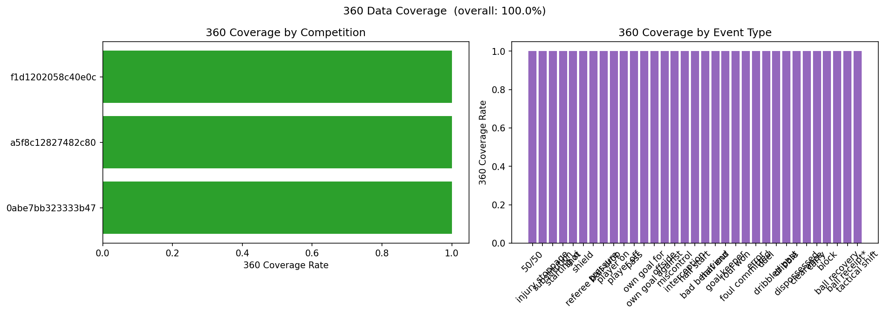
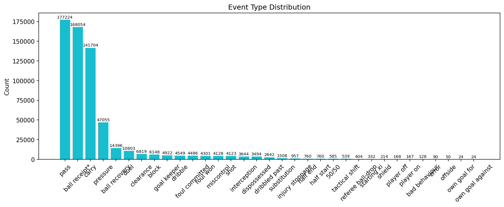
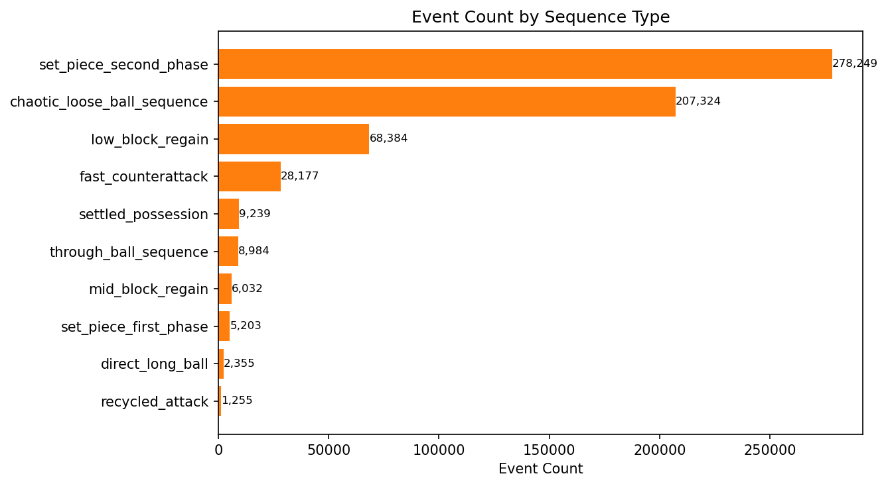
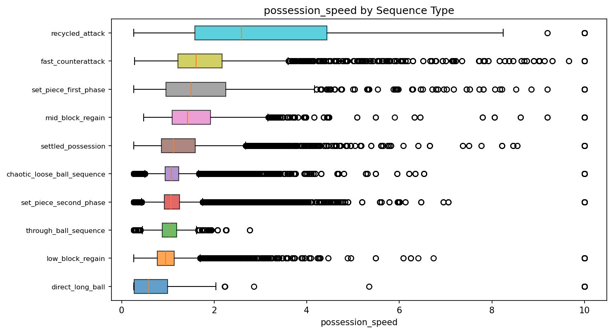

# 01 Overview And Dataset

## Purpose

This report summarizes the exploratory and inferential analysis completed to support contextual football modeling for:

- CxG: goal probability on shots
- CxA: shot creation probability within possessions and actions
- CxT: shot-in-possession threat proxy

The objective is to translate the EDA outputs into model-facing evidence: what is reliable, what is predictive, what is redundant, and what should shape feature engineering and model design.

## Dataset Scope

- Source scope: World Cup 2022, Euro 2020, Euro 2024
- Rows analyzed: 615,202 events
- Engineered feature columns: 140
- Shot sample for CxG analysis: 4,123 shots
- Possession sample for possession-level CxA analysis: 28,759 possessions
- Action sample for action-level CxA and CxT analysis: 318,928 actions

## Headline Findings

1. Data completeness is effectively production-ready. Overall missingness is negligible and all feature families have mean missing rate of 0.0.
2. Sequence type is a major structural variable, not a cosmetic label. It shows large effects for CxG and meaningful effects for CxA and CxT.
3. Recycled attacks form the clearest high-value segment. They produce both the highest shot creation rate and the highest observed goal rate.
4. Interaction effects matter. Sequence type changes its impact depending on possession start zone, body part, and event type.
5. Some feature blocks are redundant. Several opponent and freeze-frame variables are perfectly or near-perfectly correlated and should be consolidated before modeling.
6. The StatsBomb xG baseline is strong and well calibrated, so any CxG model should be assessed as incremental lift over that baseline rather than as a greenfield classifier.

## Recommended Reading Order

1. Data quality and stability: [02_data_quality_and_stability.md](./02_data_quality_and_stability.md)
2. Shot outcome evidence for CxG: [03_cxg_analysis.md](./03_cxg_analysis.md)
3. Shot creation evidence for CxA: [04_cxa_analysis.md](./04_cxa_analysis.md)
4. CxT, dependence structure, and baseline diagnostics: [05_cxt_correlations_and_baselines.md](./05_cxt_correlations_and_baselines.md)
5. Modeling implications and next steps: [06_modeling_implications.md](./06_modeling_implications.md)

## Core Supporting Charts

### Dataset coverage and composition

### Global sequence structure

## What This Means For Modeling

The evidence base supports a modeling stack that is sequence-aware, interaction-aware, and regularized against correlated engineered features. For CxG specifically, a baseline-plus-context strategy is justified: retain StatsBomb xG as a strong prior and learn additional lift from contextual covariates such as sequence type, start zone, pressure structure, and freeze-frame geometry.