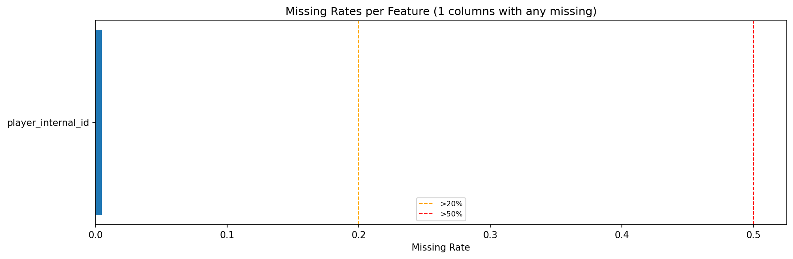
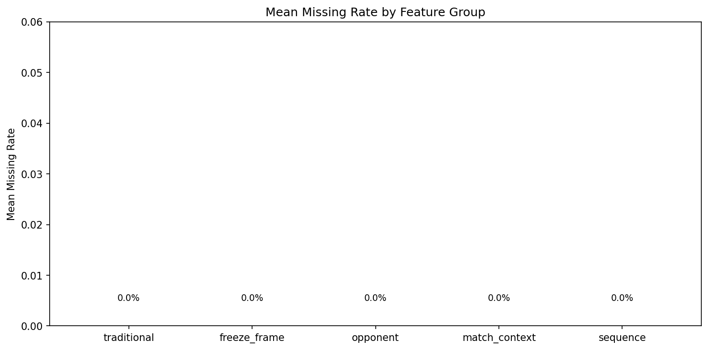
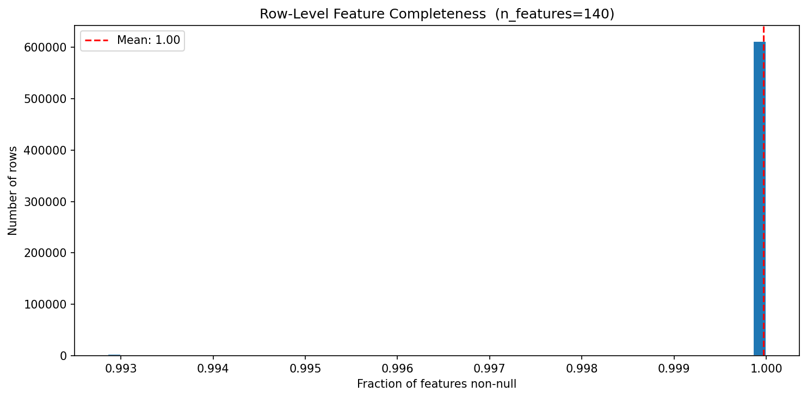
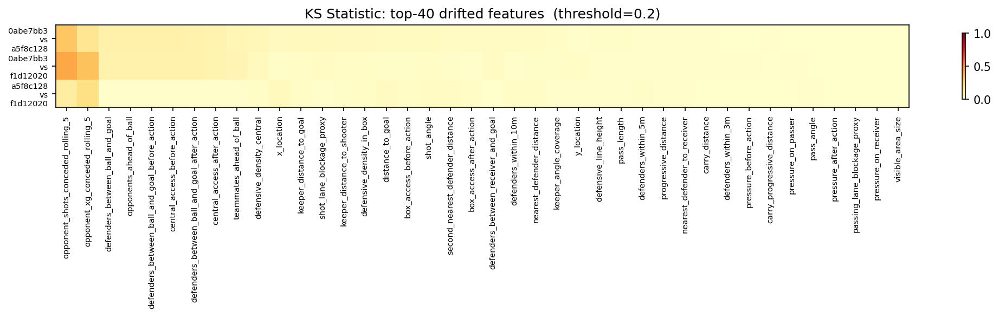
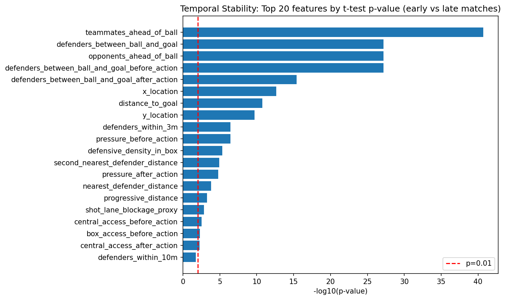

# 02 Data Quality And Stability

## Data Quality Summary

The feature store is in strong shape for modeling.

- Total rows: 615,202
- Feature columns: 140
- Total missing cells: 2,819
- Overall missing rate: effectively 0.0 at report precision
- 360 coverage rate: 1.0 across the analyzed dataset
- Dtype mismatches: 0

Feature-family completeness is also clean:

| Feature family | Features | Mean missing rate |
| --- | ---: | ---: |
| Traditional | 28 | 0.0 |
| Freeze-frame | 32 | 0.0 |
| Opponent | 16 | 0.0 |
| Match context | 10 | 0.0 |
| Sequence | 18 | 0.0 |

The only named feature with any recorded missingness in the summary is `player_internal_id` at 0.46%, which is not a core modeling driver for the contextual targets.

## Interpretation

This is not a data-cleaning bottleneck anymore. Missing-data strategy should be lightweight and explicit rather than defensive. Median imputation or sentinel handling is sufficient for the tiny residual gaps, and most model effort should move to signal design and leakage control rather than repair.

## Distribution And Completeness Evidence

## Stability Findings

Competition-level KS drift is limited in count but not absent in the opponent rolling-history variables.

- Flagged competition-drift features: 2
- Most notable drifted opponent features:
  - `opponent_shots_conceded_rolling_5`
  - `opponent_xg_conceded_rolling_5`

Temporal stability shows broader movement.

- Early-vs-late flagged features: 43
- Shifts appear in event geometry, freeze-frame pressure structure, opponent strength proxies, and match-context variables such as rest days and event counts.

The key point is not that the dataset is unstable overall, but that some context variables move over time in a statistically detectable way because the dataset spans different tournaments and match phases.

## Practical Consequences

1. Opponent rolling-form variables should be handled carefully in temporal validation because they are the most obvious drift-sensitive block.
2. Temporal cross-validation or tournament-aware splits remain necessary even though raw data quality is high.
3. Stable low-missing structural features such as sequence labels, geometric shot features, and freeze-frame counts are safer core inputs.

## Supporting Charts

## Modeling Guidance

Use time-aware validation as a default. Do not overreact by removing drift-sensitive variables wholesale; instead, test whether they add out-of-sample value under tournament-aware splits. If they fail there, drop or regularize them.