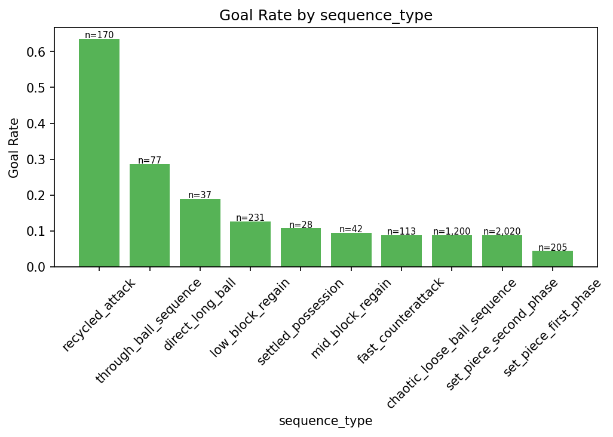
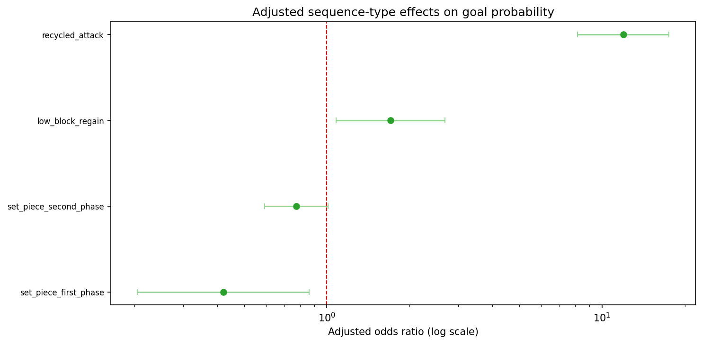
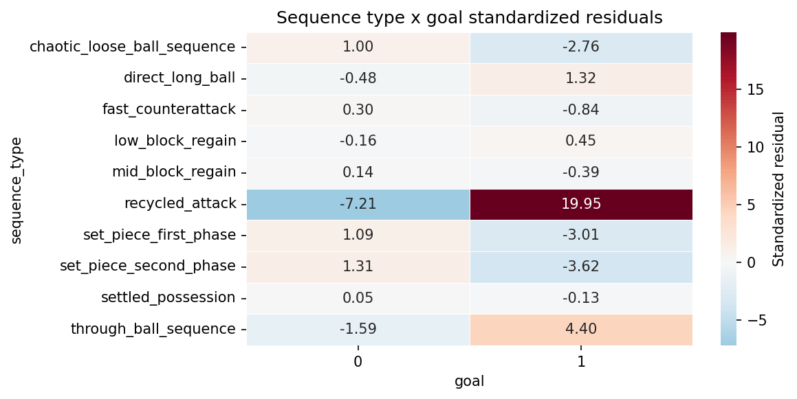
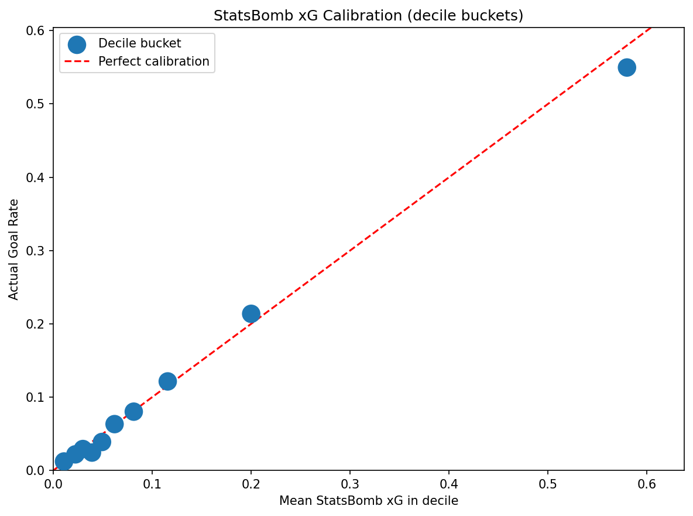
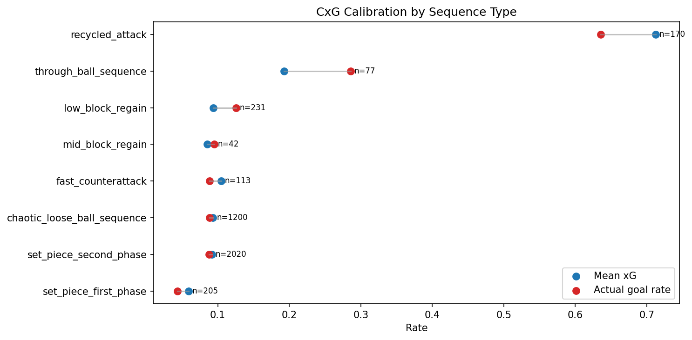
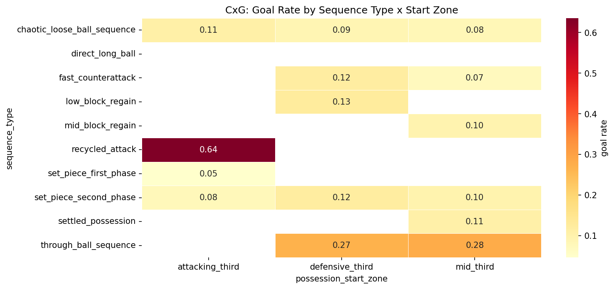
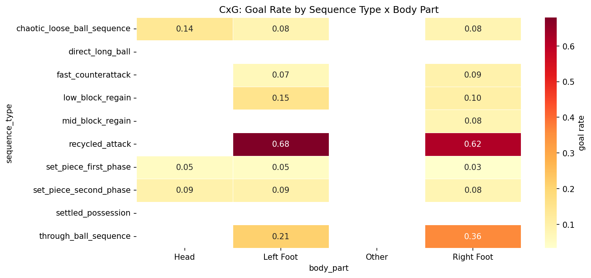

# 03 CxG Analysis

## Objective

CxG modeling focuses on whether a shot becomes a goal. The analysis here evaluates the baseline signal, contextual segmentation, calibration heterogeneity, and whether sequence context adds lift beyond standard shot geometry.

## Sample And Baseline

- Shots: 4,123
- Goals: 476
- Observed goal rate: 11.54%
- Mean StatsBomb xG: 11.90%

The baseline is already strong:

- Log loss: 0.2638
- Brier score: 0.0757
- ROC-AUC: 0.8389
- Average precision: 0.4980
- ECE: 0.0131

Cross-validation remains consistent, with mean ROC-AUC 0.8311 and mean ECE 0.0249 over 5 folds. This confirms that the baseline is both discriminative and well calibrated.

## Sequence Type Is A High-Signal Context Feature

Sequence type has a large association with goal outcome:

- Chi-square: 508.60
- p-value: 8.26e-104
- Cramer's V: 0.351

Observed goal rates by sequence type show a very non-uniform landscape:

| Sequence type | Shots | Goals | Goal rate |
| --- | ---: | ---: | ---: |
| Recycled attack | 170 | 108 | 63.53% |
| Through-ball sequence | 77 | 22 | 28.57% |
| Direct long ball | 37 | 7 | 18.92% |
| Low-block regain | 231 | 29 | 12.55% |
| Fast counterattack | 113 | 10 | 8.85% |
| Chaotic loose-ball sequence | 1,200 | 106 | 8.83% |
| Set-piece second phase | 2,020 | 178 | 8.81% |
| Set-piece first phase | 205 | 9 | 4.39% |

Recycled attacks are the dominant outlier, sitting more than 52 percentage points above the overall baseline rate.

## Adjusted Effects Beyond Shot Geometry

An adjusted logistic model with `C(sequence_type) + distance_to_goal + shot_angle` still shows large sequence-type effects.

- Recycled attack odds ratio: 11.94, p = 2.91e-37
- Low-block regain odds ratio: 1.70, p = 0.0218
- Set-piece first phase odds ratio: 0.42, p = 0.0178

This is the core modeling evidence: sequence context is not merely proxying distance and angle. It adds independent structure beyond standard shot geometry.

## Calibration Heterogeneity

Calibration is not uniform across subgroups.

- Best subgroup ECE: chaotic loose-ball sequence at 0.016
- Worst subgroup ECE: recycled attack at 0.102
- Through-ball sequence also shows elevated subgroup ECE at about 0.103

This means a global calibrator may hide segment-specific misspecification. High-value sequence types are exactly where calibration gets harder, which is important for downstream ranking and decision support.

## Interaction Evidence

The deep EDA found strong interaction structure:

- Sequence type x possession start zone: chi-square 521.3, Cramer's V 0.356
- Sequence type x body part: chi-square 542.3, Cramer's V 0.363

These are large effects. The implication is that additive-only models will likely underfit shot context unless they learn interactions explicitly or via tree structure.

## Hypothesis Test Summary

Bonferroni-corrected CxG hypotheses rejected 3 out of 6 nulls.

Supported findings:

- Inside-box shots have much higher xG than outside-box shots
- Sequence length differs materially in xG distribution
- Score state is associated with goal rate

Not supported after correction:

- Header vs foot goal rate
- Home vs away goal rate
- Nearest defender distance difference between goals and non-goals

The strongest and most stable shot-level signal remains geometry, but sequence type materially sharpens the context around it.

## Why Pass And Carry Transport Features Do Not Show Up As CxG Correlates

The shot-level correlation analysis now excludes constant predictors before ranking CxG features. This matters because several transport-style variables in the shot table are not varying at all within the current shot sample:

- `pass_length`
- `pass_angle`
- `carry_distance`
- `carry_progressive_distance`
- `progressive_distance`

In the current `shots.parquet` slice, those columns are effectively placeholders for shot rows rather than informative shot-state measurements. Three of them are all zeros and two have a single repeated non-zero value across all 4,123 shots. A constant predictor cannot produce a valid point-biserial correlation with `goal`, so these fields should not be interpreted as having weak negative or weak positive CxG signal. They are simply undefined for this shot-level correlation test.

This is also why CxG correlation ranking is dominated by variables that actually vary at shot time, such as:

- `shot_statsbomb_xg`
- `shot_angle`
- `distance_to_goal`
- defensive-blocking and pressure-structure features

Those pass and carry transport variables remain more relevant for CxA and CxT, where the target concerns buildup and possession progression rather than shot conversion alone.

## Supporting Charts

## Modeling Implications

1. Start from StatsBomb xG as a baseline feature or benchmark, not as something to replace blindly.
2. Add sequence type as a first-class feature for contextual lift.
3. Include interactions between sequence type and start zone, body part, and possibly set-piece state.
4. Evaluate subgroup calibration, especially for recycled attacks and through-ball sequences.
5. Prefer model families that can learn nonlinear interactions cleanly, such as boosted trees or additive models with targeted interaction terms.