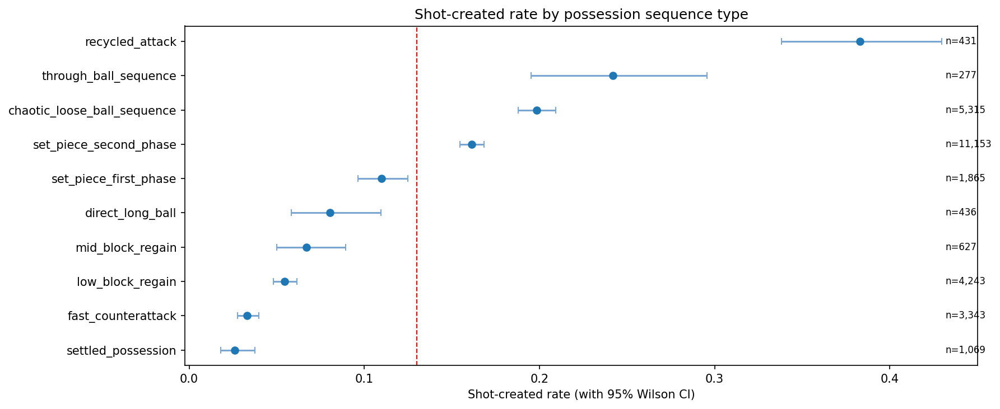
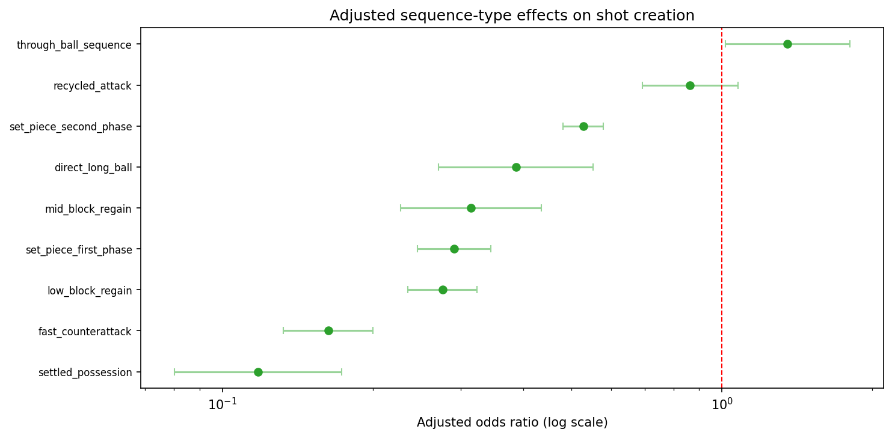
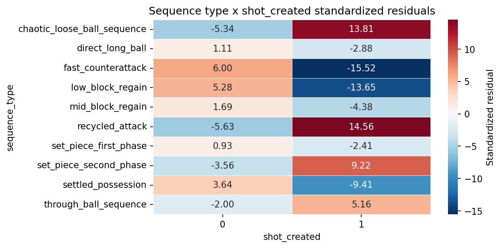
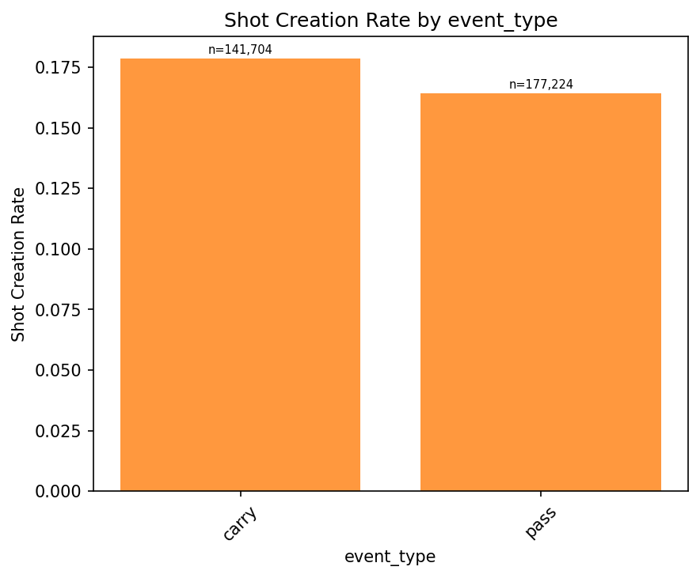
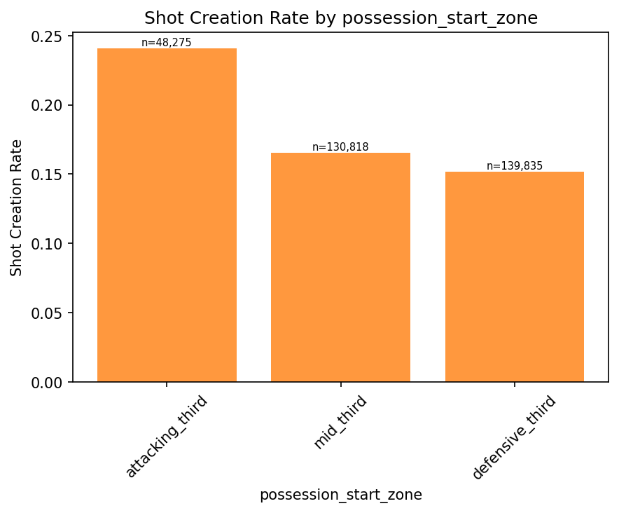
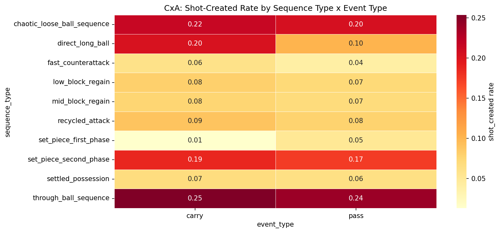
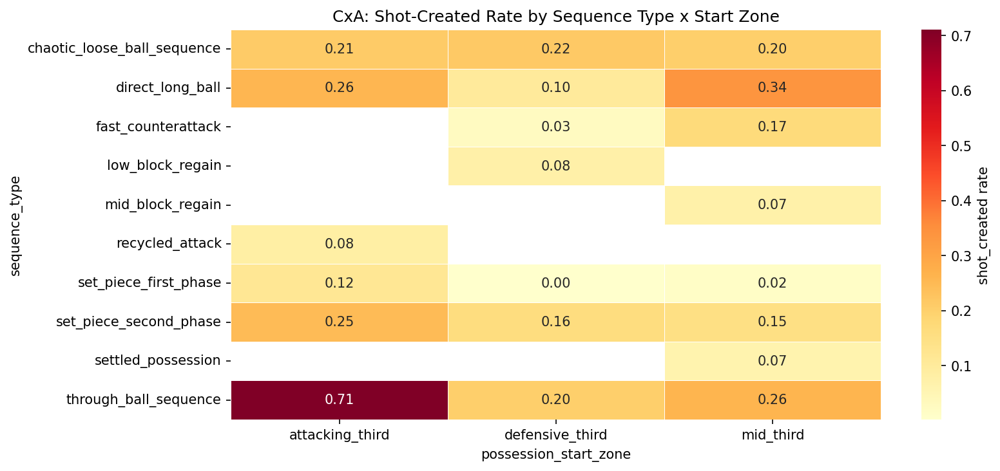

# 04 CxA Analysis

## Objective

CxA analysis studies how actions and possessions convert into shots. The evidence here is especially relevant for modeling attacking buildup, possession value, and sequence-level shot creation likelihood.

## Possession-Level Sequence Findings

Possession-level shot creation varies sharply by sequence type.

- Possessions analyzed: 28,759
- Overall shot-created rate: 13.00%
- Sequence association chi-square: 1222.32
- p-value: 1.84e-257
- Cramer's V: 0.206

Possession-level shot creation rates:

| Sequence type | Possessions | Shot-created rate |
| --- | ---: | ---: |
| Recycled attack | 431 | 38.28% |
| Through-ball sequence | 277 | 24.19% |
| Chaotic loose-ball sequence | 5,315 | 19.83% |
| Set-piece second phase | 11,153 | 16.15% |
| Set-piece first phase | 1,865 | 10.99% |
| Direct long ball | 436 | 8.03% |
| Mid-block regain | 627 | 6.70% |
| Low-block regain | 4,243 | 5.44% |
| Fast counterattack | 3,343 | 3.32% |
| Settled possession | 1,069 | 2.62% |

Recycled attack is again the standout segment, with nearly three times the baseline shot-creation rate.

## Adjusted Interpretation

The adjusted bivariate work showed that sequence effects remain material even after accounting for possession start-zone controls. That means sequence type is encoding more than just where the team started the possession.

This matters for model construction because many possession-value systems already include territorial state. The evidence here says territorial state alone is not enough.

## Action-Level Hypothesis Results

Bonferroni-corrected CxA hypotheses rejected 6 out of 7 nulls.

Supported findings include:

- Final-third actions create shots much more often than other actions
- Carries slightly outperform passes for shot creation on average
- Transition vs settled context differs materially in shot-creation rate
- Higher pressing context is associated with lower shot-creation rate
- Score state affects shot creation
- Directness is negatively correlated with shot creation (`r = -0.1796`)

Not supported:

- Progressive action flag by itself does not outperform non-progressive actions in the tested comparison

The signal profile suggests that CxA is driven less by a single binary notion of progression and more by a combination of territorial access, event type, sequence identity, and pressure context.

## Interaction Evidence

The deep EDA shows that CxA is materially interaction-driven:

- Sequence type x event type: chi-square 5927, Cramer's V 0.136
- Sequence type x possession start zone: chi-square 8403, Cramer's V 0.162

These are moderate but operationally meaningful effects at very large sample size. They indicate that the value of a pass, carry, or other action depends on the sequence setting around it.

## What The Pattern Suggests

1. Recycled attacks are not just good finishing states; they are also strong shot-generation states.
2. Through-ball sequences are a high-value but lower-volume segment and should be preserved rather than smoothed away by aggressive regularization.
3. Fast counterattacks underperform in this labeled framework relative to common intuition, which likely reflects how the current sequence taxonomy partitions event chains rather than a football truth in isolation.
4. CxA should likely be modeled at both action and possession level, with shared contextual features but different targets.

## Supporting Charts

## Modeling Implications

1. Sequence type should be a core feature in both possession-level and action-level CxA models.
2. Include interaction terms or tree splits involving sequence type with event type and possession start zone.
3. Keep carries and passes separated rather than prematurely collapsing them into generic progression.
4. Consider hierarchical evaluation: overall AUC or log loss plus per-sequence calibration and lift.