# 05 CxT, Correlations, And Baselines

## CxT Signal Summary

CxT uses shot-in-possession style outcomes to proxy possession threat. The analysis indicates that threat accumulation is more sensitive to contextual state than to single continuous progression measures.

Bonferroni-corrected CxT hypotheses rejected 5 out of 6 nulls.

Supported findings:

- Transition vs settled context differs materially in SIP rate
- Directness is negatively associated with SIP (`r = -0.1796`)
- Possessions starting in attacking zones produce higher SIP rates than those starting in defensive zones
- Low pressing context is associated with higher SIP rate than high pressing context
- Longer possessions are positively associated with SIP (`rho = 0.1792`)

Not supported:

- Vertical progression by itself shows no meaningful linear relationship with SIP (`r = -0.0007`)

This suggests CxT should not be reduced to one-dimensional territorial gain. Sequence context, pressure, and possession continuation structure matter more.

## Supporting CxT Charts

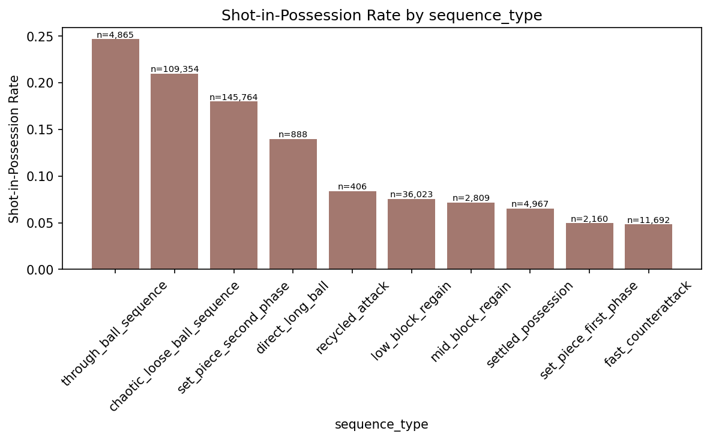

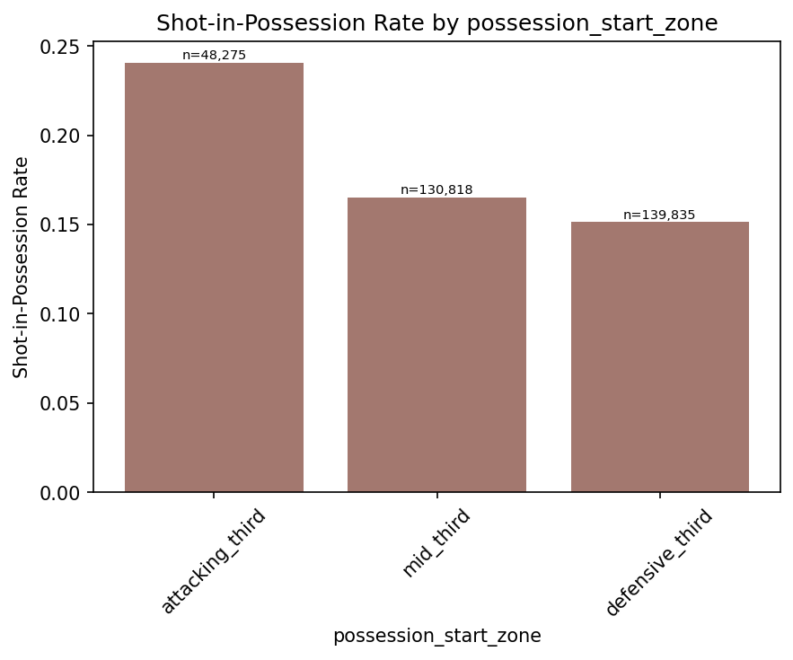

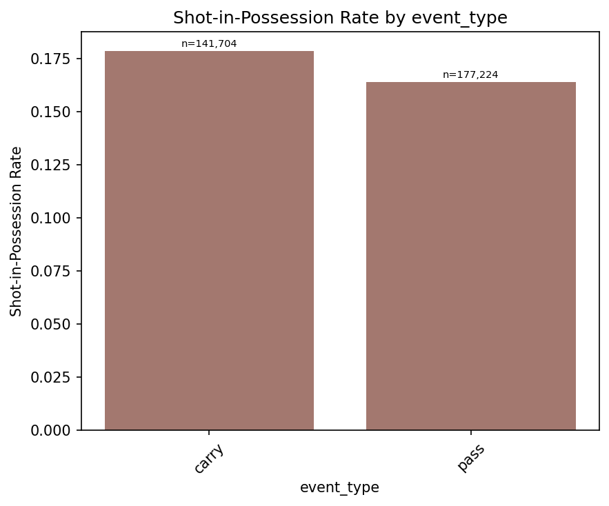

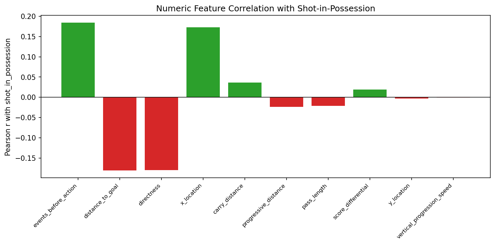

## Correlation Structure And Redundancy

The feature set contains several highly redundant pairs. The correlation summary flagged 39 high Spearman pairs, including multiple exact 1.0 relationships.

Examples:

- `defenders_within_3m` and `pressure_before_action`
- `defenders_between_ball_and_goal` and `opponents_ahead_of_ball`
- `defenders_between_ball_and_goal` and `defenders_between_ball_and_goal_before_action`
- `opponent_set_piece_defence_strength` with several opponent defensive rating variants
- `opponent_keeper_shot_stopping_rating`, `opponent_team_elo`, and `opponent_team_strength`

This is useful, not alarming. It means the engineered feature store successfully captures similar latent constructs from multiple angles, but linear or generalized linear models will need consolidation or regularization.

For CxG specifically, the point-biserial ranking should be read as a shot-state diagnostic rather than as a generic feature-importance table. Transport-style variables such as `pass_length`, `pass_angle`, `carry_distance`, `carry_progressive_distance`, and `progressive_distance` are excluded from valid CxG ranking because they are constant in the shot table and therefore have undefined correlation with `goal`. In other words, their absence from the corrected CxG ranking does not mean that buildup never matters; it means those particular columns are not varying at shot level in the current shot dataset.

## Correlation Charts

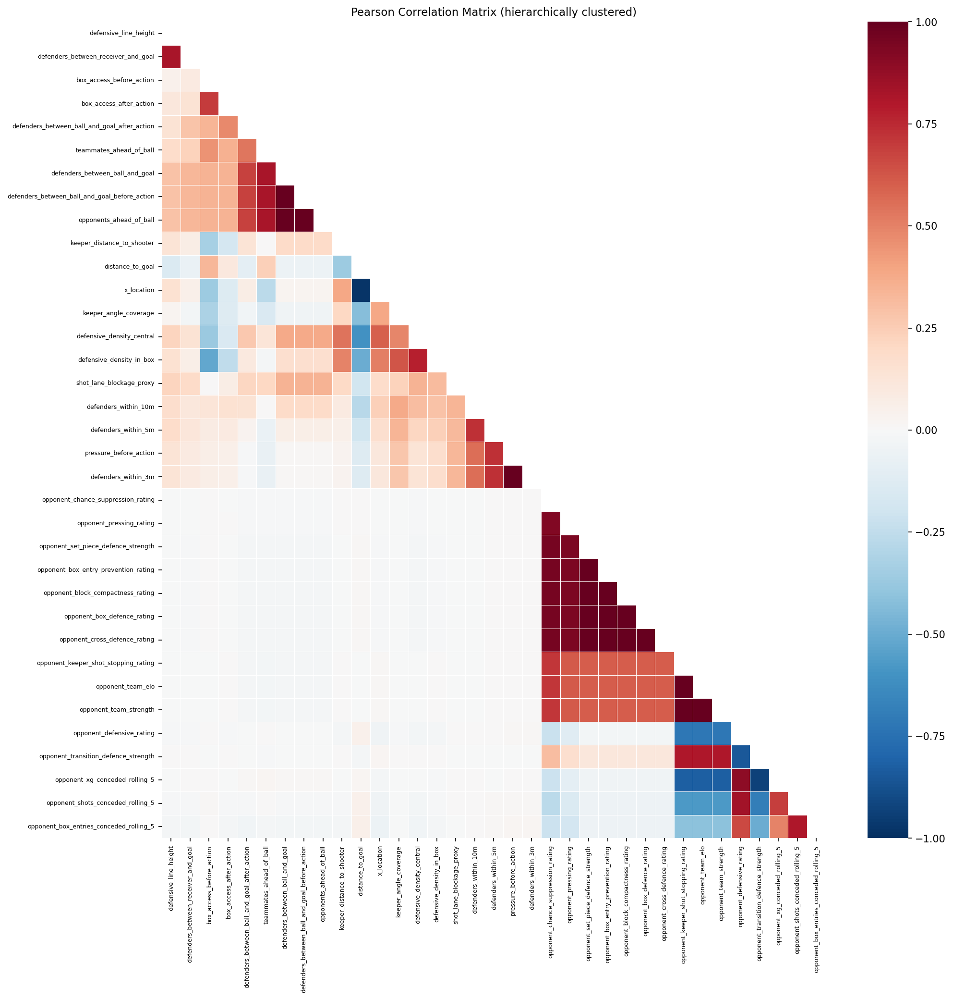

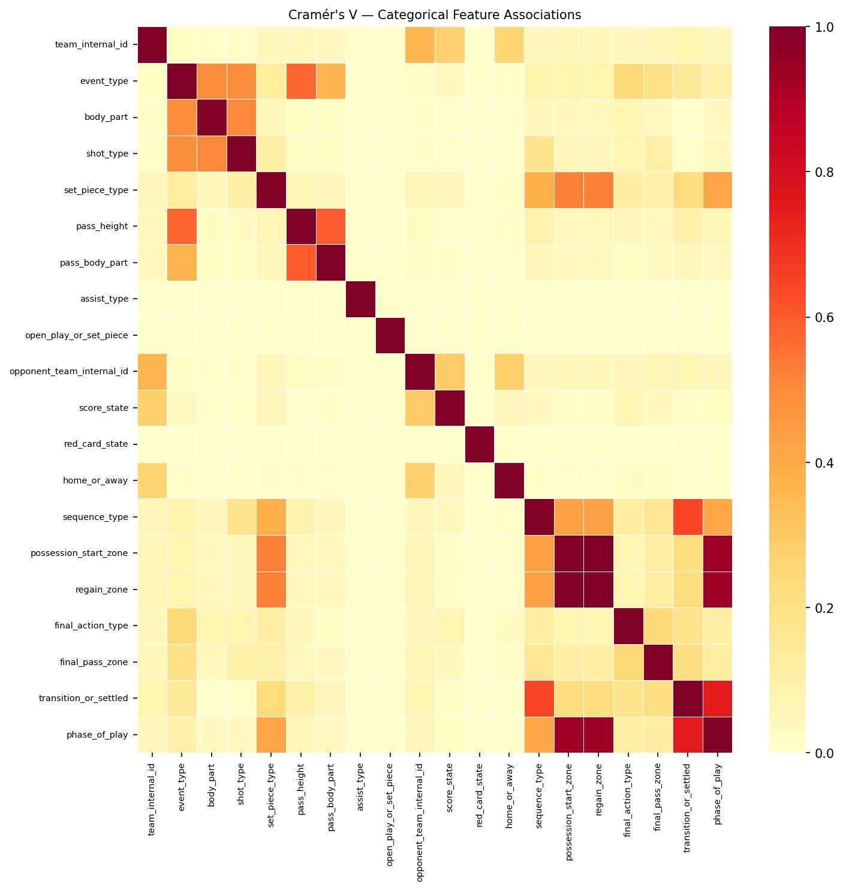

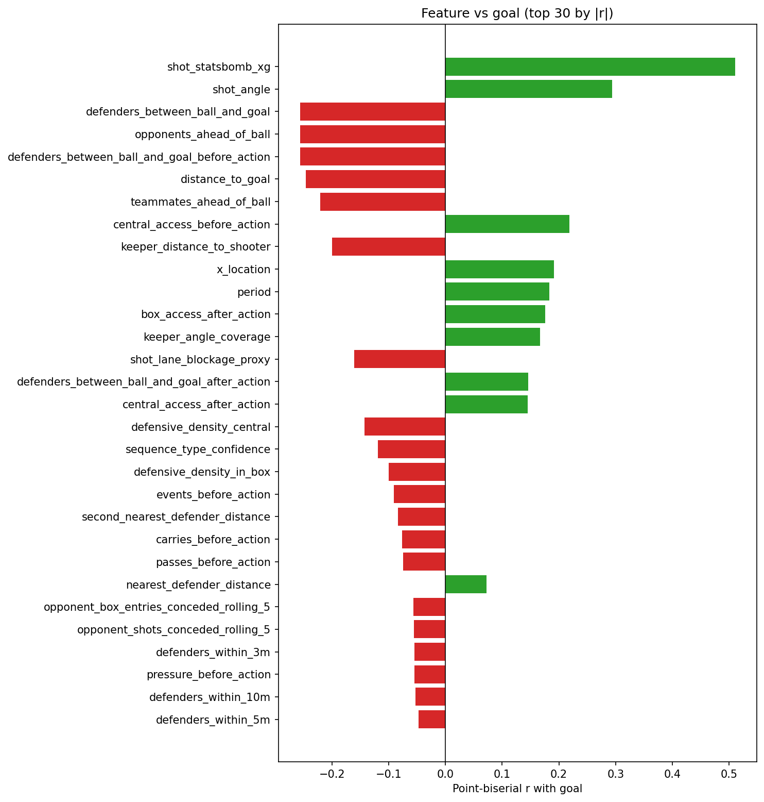

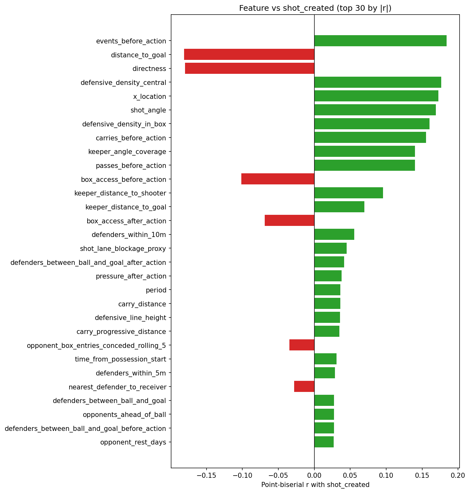

## Baseline Model Evidence

The StatsBomb xG baseline provides a strong reference point for shot modeling.

| Metric | Value |
| --- | ---: |
| Log loss | 0.2638 |
| Brier score | 0.0757 |
| ROC-AUC | 0.8389 |
| Average precision | 0.4980 |
| ECE | 0.0131 |

This means the contextual CxG model should be framed as an incremental model. It must beat or complement an already competent prior.

For CxT, the zone prior work is also valuable because it gives a spatially grounded initialization surface for downstream threat models.

## Baseline Charts

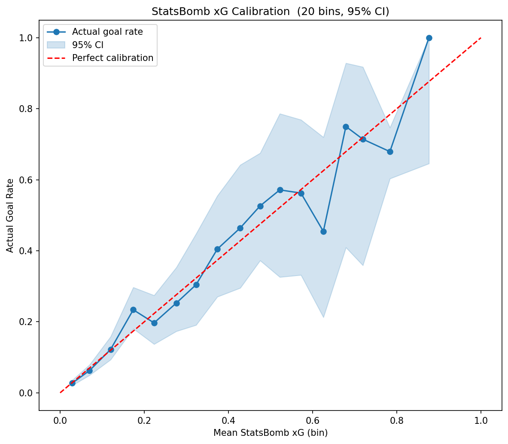

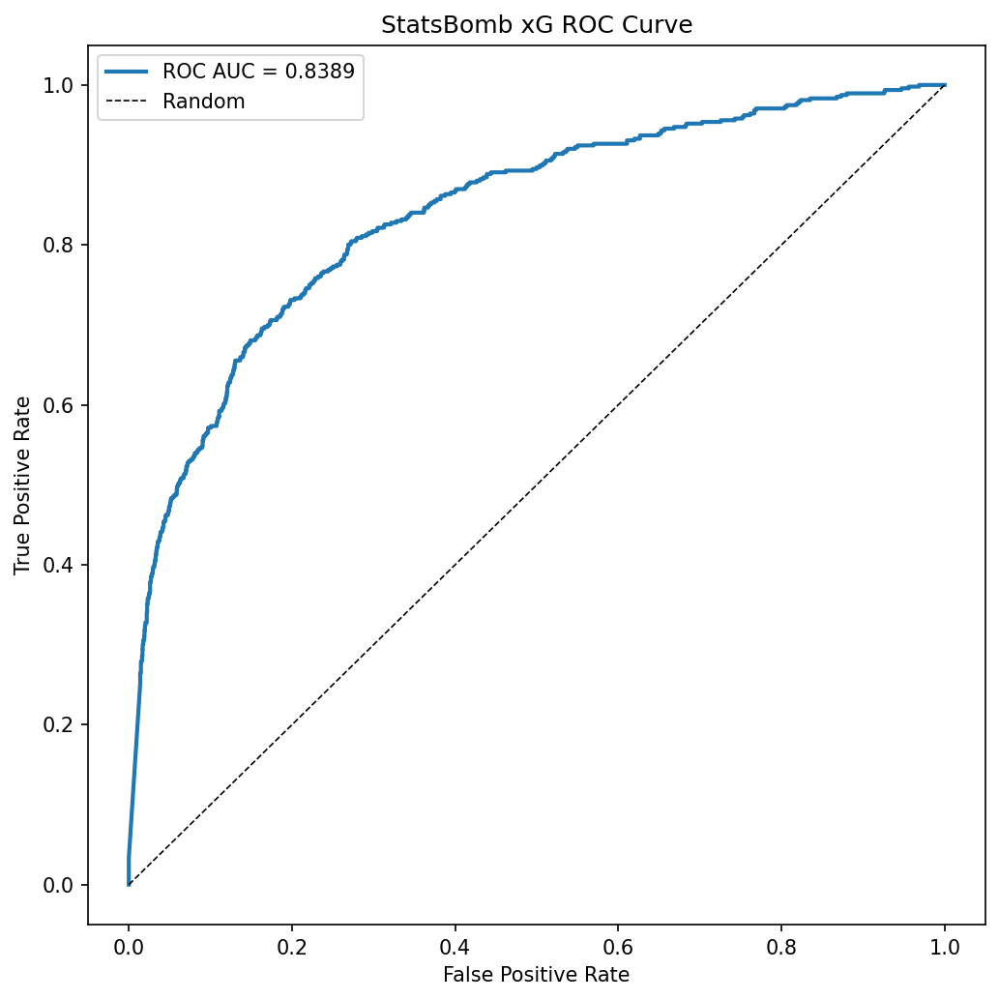

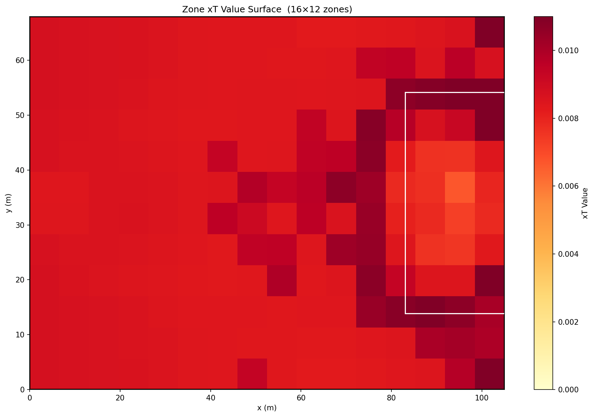

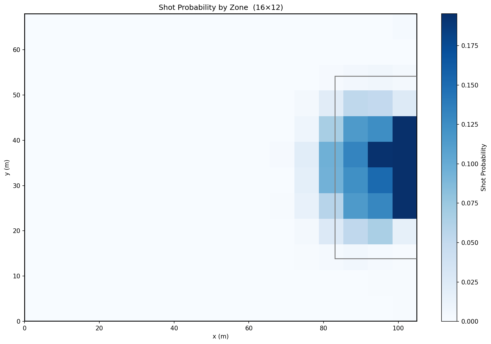

## Modeling Guidance

1. Remove or collapse exact-duplicate feature families before fitting linear models.
2. Tree models can tolerate more redundancy, but duplicated signals still complicate interpretation and importance analysis.
3. Use the zone xT prior as an initialization or benchmark feature for CxT rather than training without a spatial prior.
4. For CxG, treat StatsBomb xG as a baseline covariate and benchmark on top of it.
