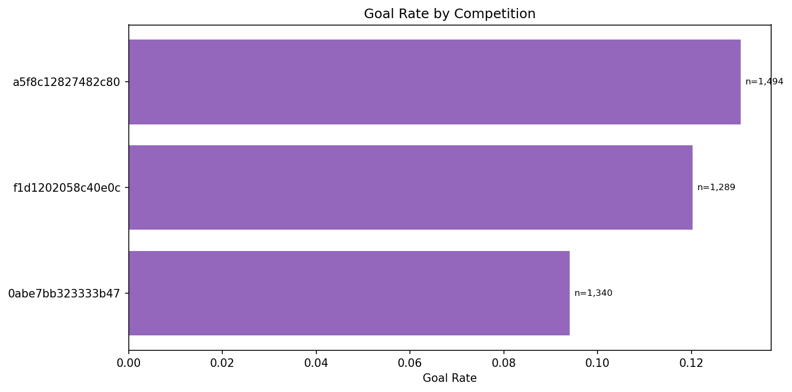
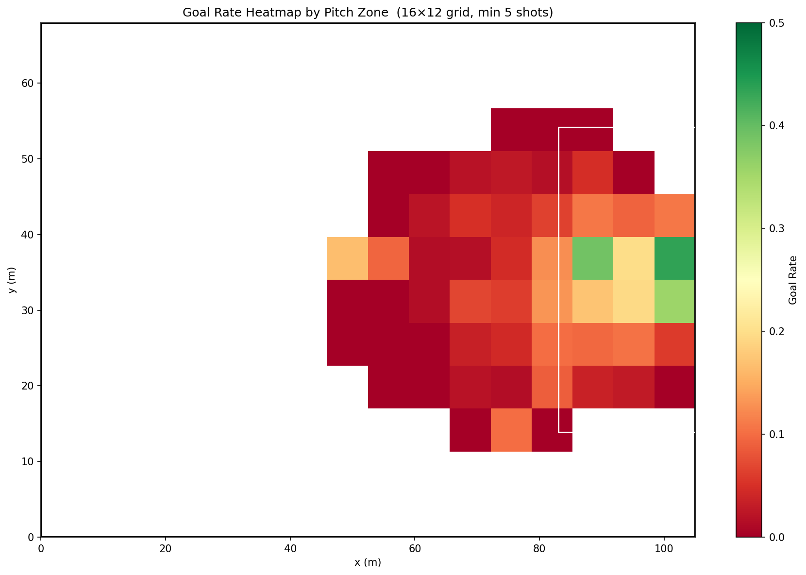
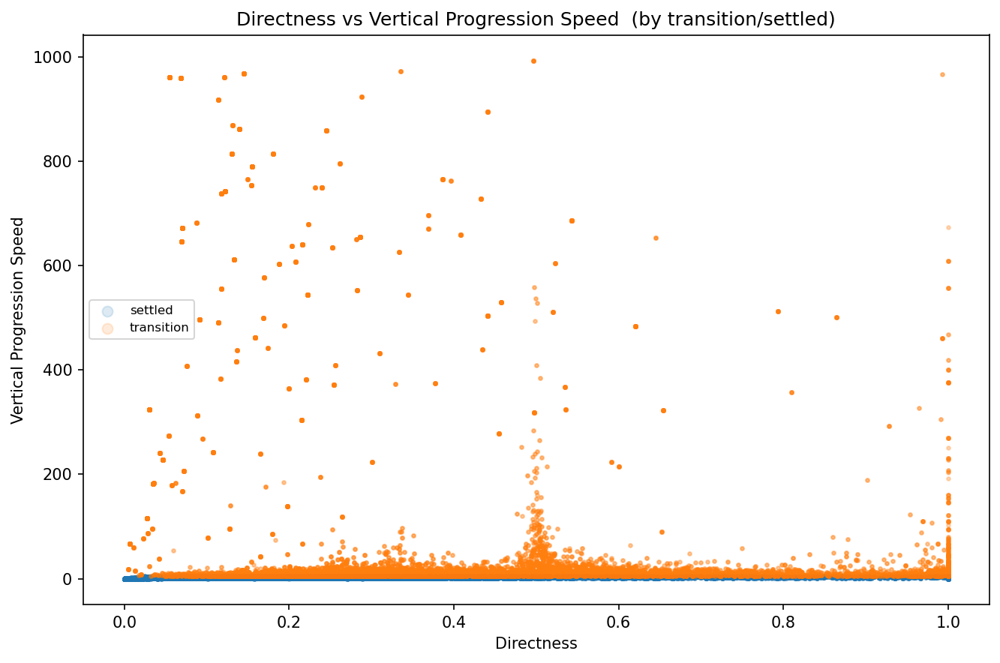
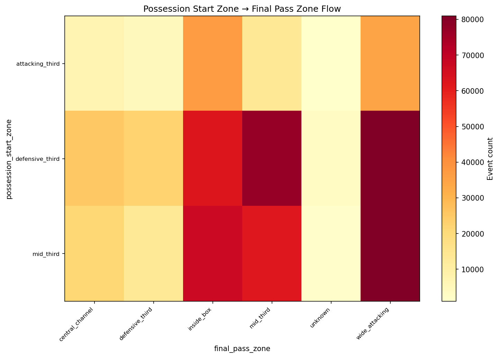

# 06 Modeling Implications

## What The Analysis Supports

The combined evidence supports a modeling strategy with three principles:

1. Build on strong priors rather than replacing them.
2. Preserve sequence context and its interactions.
3. Control redundancy before claiming interpretability.

## Recommended Feature Strategy

### Shared core features

- Sequence type
- Possession start zone
- Score state
- Pressure context
- Event type
- Freeze-frame geometry
- Opponent strength block after de-duplication

### CxG-specific additions

- StatsBomb xG as a baseline feature
- Distance to goal
- Shot angle
- Body part
- Interaction candidates: sequence type x start zone, sequence type x body part

### CxA-specific additions

- Event type split between passes, carries, and other attacking actions
- Box entry and central progression indicators
- Through-ball and cross indicators
- Interaction candidates: sequence type x event type, sequence type x start zone

### CxT-specific additions

- Zone xT prior
- Possession length
- Directness and progression measures
- Transition vs settled context

## Recommended Modeling Stack

### CxG

Use a stacked or residualized strategy:

1. Baseline input: StatsBomb xG
2. Context model: learn residual lift from contextual features
3. Final calibration: overall plus subgroup checks by sequence type

This approach respects the strong baseline while still letting context improve ranking and calibration where the baseline is weakest.

### CxA

Train both:

1. Action-level shot creation model
2. Possession-level shot creation model

The action model captures local decision value. The possession model captures whether the sequence as a whole creates a shot. Shared contextual encoders can support both.

### CxT

Use a spatial-context hybrid model. The zone prior gives stable territorial grounding, while sequence and context features explain why two possessions from similar zones can diverge in downstream threat.

## Validation Strategy

The data-quality results support aggressive experimentation, but the stability results require disciplined validation.

Recommended validation design:

1. Tournament-aware or temporally ordered folds
2. Segment reporting by sequence type
3. Calibration reporting overall and by high-value subgroups
4. Ablations for redundant feature blocks

Minimum useful ablations:

- Baseline geometry only vs baseline plus sequence type
- Baseline plus sequence type vs baseline plus sequence type and interactions
- Full model vs de-duplicated opponent-feature block

## Risks To Watch

1. Redundant engineered variables can inflate apparent feature importance.
2. Small high-value subgroups such as through-ball sequences can be washed out by class imbalance handling.
3. Recycled attacks look extremely strong, so leakage checks around sequence definitions and shot-chain construction remain important.
4. Global calibration may appear good while subgroup calibration remains poor.

## Final Conclusion

The analysis is strong enough to move from EDA into model iteration. The cleanest modeling hypothesis is:

Contextual lift comes primarily from sequence identity and interaction structure layered on top of already strong geometric and spatial priors.

That hypothesis is well supported by the current evidence base:

- Large CxG sequence effect size (`V = 0.351`)
- Meaningful CxA possession-level sequence effect size (`V = 0.206`)
- Strong interaction effects in the deep EDA
- Good baseline calibration with room for subgroup improvement
- Minimal missingness and no dtype issues blocking production modeling

## Final Supporting Charts

